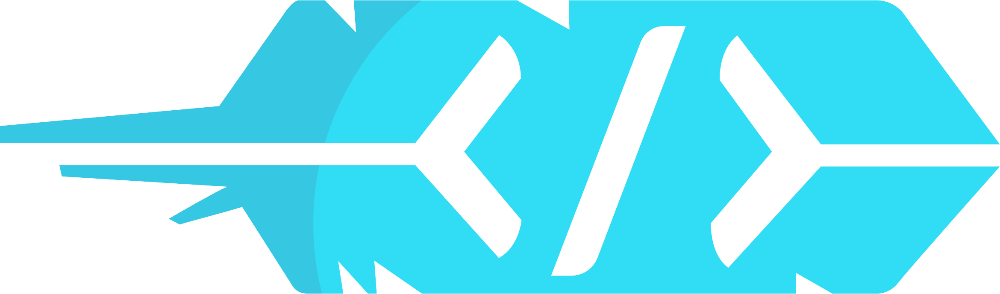

  

# HACKFSU will return

### ABOUT
**HackFSU** was an annual, student-led hackathon at Florida State Unversity, running from spring 2014 to fall 2019.

Over the course of 6 years, **HackFSU** saw hundreds of volunteers, dozen of high-profile sponsors, and thousands of attendees from all across the country.

If you an FSU student interested in continuing the legacy of **HackFSU**, please contact [webmaster@hackfsu.com](mailto:webmaster@hackfsu.com).

